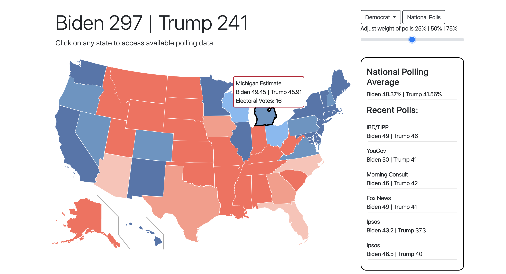

# 2020 | Election Data

- deployed at https://jscottusf.github.io/election-data/
- Using FiveThirtyEight data to track 2020 general election polling data
- Interactive map which displays polling data and rough estimate of election day probabilities
- Click on any state to see up to date polling data and averages
- Adjust weight of polls versus state partisan lean
- For a limited time only...you can project both Bernie Sanders and Joe Biden

## Web Application
- Intereactive web application allowing user to access polling data and election day forcast

## node.js Application
- In development. User will be able to access polling data via the terminal and MySQL